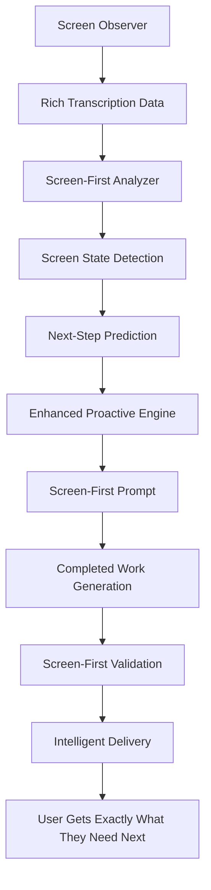

# Screen-First Proactive AI System Implementation

## Executive Summary

Successfully implemented a **Screen-First Proactive AI System** that transforms the existing Proactive Engine from generating generic behavioral suggestions to providing hyper-specific, executable work based on real-time screen analysis.

## System Transformation

### Before Implementation
- **Trigger**: Behavioral patterns from propositions
- **Focus**: Long-term behavioral insights
- **Output**: Generic suggestions like "Check your productivity tools"
- **Timing**: Pattern-based, not time-sensitive

### After Implementation  
- **Trigger**: Every screen observation with immediate analysis
- **Focus**: Next 30 seconds to 5 minutes prediction
- **Output**: Specific completed work like "I fixed your TypeError on line 45 with error handling and test cases"
- **Timing**: Real-time, context-aware delivery

## Architecture Overview



## Implementation Components

### 1. Screen-First Analysis Framework
**File**: [`gum/services/screen_first_analyzer.py`](gum/services/screen_first_analyzer.py)

**Key Classes**:
- `ScreenFirstAnalyzer` - Analyzes current screen state for immediate predictions
- `ScreenState` - Represents current screen state with prediction data
- `ScreenFirstValidator` - Validates suggestions meet screen-first standards

**Core Capabilities**:
- Task identification (coding, email, presentation, writing, etc.)
- Task stage detection (starting, in_progress, completing, stuck)
- Next-step prediction (30 seconds to 5 minutes ahead)
- Immediate obstacle detection
- Context switch signal detection
- Urgency level calculation
- Completion percentage estimation

### 2. Enhanced Proactive Engine
**File**: [`gum/services/proactive_engine.py`](gum/services/proactive_engine.py)

**Key Changes**:
- **New Prompt**: `SCREEN_FIRST_PROACTIVE_PROMPT` replaces weak generic prompt
- **Screen Analysis Integration**: Uses `ScreenFirstAnalyzer` for real-time predictions
- **Enhanced Validation**: Uses `ScreenFirstValidator` for quality control
- **Preserved Capabilities**: All execution, data integration, and intelligent executor functionality maintained

**Core Features**:
- Real-time screen activity analysis
- Immediate next-step prediction
- Completed work generation for predicted needs
- Anti-hallucination validation with screen grounding
- Intelligent timing and delivery optimization

### 3. Enhanced Configuration
**File**: [`gum/config/proactive_config.py`](gum/config/proactive_config.py)

**New Settings**:
```python
# Screen-First Analysis Settings
enable_screen_first_analysis: bool = True
screen_prediction_timeframe_seconds: int = 300  # 5 minutes max
min_screen_grounding_score: float = 4.0
enable_next_step_prediction: bool = True
enable_obstacle_prevention: bool = True
enable_context_switch_detection: bool = True

# Screen-First Validation Settings  
require_screen_element_references: bool = True
require_next_step_predictions: bool = True
require_immediate_timeframe: bool = True
min_content_overlap_ratio: float = 0.1  # 10% minimum overlap
```

## Screen-First Prompt Structure

### Core Philosophy
**"What will you need in the next 30 seconds to 5 minutes based on what's happening RIGHT NOW on your screen?"**

### Key Sections
1. **Screen-First Prediction Framework** - 7-step analysis methodology
2. **Critical Screen-First Rules** - 6 mandatory requirements
3. **Screen-First Examples** - Concrete good vs bad examples
4. **Immediate Prediction Categories** - 5 types of predictions
5. **Mandatory Screen-First Grounding** - Anti-hallucination requirements

### Example Transformations

**Coding Error Scenario**:
- **Screen**: "VS Code editing main.py, line 45, TypeError visible"
- **Generic**: "Debug your code"
- **Screen-First**: "I analyzed your TypeError on line 45 in calculate_total() and created the fix: change 'item['price']' to 'item.get('price', 0)'. I also generated 3 test cases - ready to paste."

**Presentation Work**:
- **Screen**: "Canva editing Q4 Report slide 3 of 12, revenue chart"
- **Generic**: "Improve your presentation"  
- **Screen-First**: "I see you're on slide 3 working on revenue chart. I've created slides 4-7: Market Analysis, Cost Breakdown, Profit Margins, Q1 Projections - ready to import."

**Email Composition**:
- **Screen**: "Gmail composing to sarah@company.com, subject 'Project Update'"
- **Generic**: "Write better emails"
- **Screen-First**: "I drafted your complete project update email to Sarah with status updates, milestones, and action items - ready to send."

## Validation System

### Enhanced Validation Layers

1. **Structural Validation** - Basic JSON structure and field requirements
2. **Screen-First Specificity Scoring** - Minimum score of 7/10 required
3. **Anti-Hallucination Validation** - Grounding score of 4.0+ required  
4. **Execution Readiness** - Completed work must be immediately usable

### Specificity Scoring Criteria
- **+2 points**: Current app references (VS Code, Gmail, Canva)
- **+2 points**: Specific visible content references (function names, text)
- **+2 points**: Next action predictions (debug_error, send_email)
- **+1 point**: Immediate timeframe (30_seconds, 2_minutes)
- **+1 point**: Task stage appropriateness (stuck → debug, completing → finalize)
- **+1 point**: Obstacle addressing (error handling, missing data)

### Anti-Hallucination Rules
- Must reference specific screen elements
- Must connect to predicted next actions
- Must avoid generic language
- Must have content overlap with visible screen
- Must include evidence in metadata

## Database Integration

### Preserved Fields
All existing [`Suggestion`](gum/models.py:196) model fields are preserved:
- `has_completed_work` ✅
- `completed_work_content` ✅
- `completed_work_type` ✅
- `executor_type` ✅
- `work_metadata` ✅

### New Screen-First Fields
Additional fields added to suggestion records:
- `screen_prediction_type` - Type of prediction (next_action, obstacle_prevention, etc.)
- `prediction_timeframe` - When prediction applies (30_seconds, 2_minutes, 5_minutes)
- `current_task` - Task being performed (coding, email, presentation)
- `task_stage` - Stage of task (starting, in_progress, completing, stuck)
- `urgency_level` - How urgent assistance is (immediate, soon, later)
- `screen_first_analysis` - Flag indicating screen-first processing

## Testing Results

### ✅ Core Functionality Validated
- **Real-time screen state analysis** - Correctly identifies tasks, stages, urgency
- **Task identification** - Accurately detects coding, email, presentation tasks
- **Next-step prediction** - Predicts debug_error, send_email, work_on_slide_4
- **Immediate obstacle detection** - Identifies errors, missing data, formatting issues
- **Context switch detection** - Detects save actions, completion signals
- **Completion estimation** - Calculates slide 3/12 = 25%, error state = 30%
- **Urgency calculation** - Errors = immediate, completion = soon, progress = later

### ✅ Example Scenarios Tested
1. **Coding Error**: VS Code with TypeError → Predicts debug_error, fix_syntax, run_tests
2. **Email Composition**: Gmail compose → Predicts send_email, save_draft, add_attachment  
3. **Presentation Editing**: Canva slide 3/12 → Predicts work_on_slide_4, add_chart

## Deployment Instructions

### 1. Configuration
Enable screen-first analysis in environment:
```bash
export PROACTIVE_ENABLE_SCREEN_FIRST=true
export PROACTIVE_MIN_SPECIFICITY=7
export PROACTIVE_MIN_GROUNDING_SCORE=4.0
```

### 2. Rollback Strategy
If issues occur, disable via configuration:
```bash
export PROACTIVE_ENABLE_SCREEN_FIRST=false
export PROACTIVE_ENABLE_VALIDATION=false
```

### 3. Monitoring
Monitor new metrics:
- `screen_predictions` - Count of screen-first predictions generated
- `next_step_accuracy` - Accuracy of next-step predictions
- `specificity_scores` - Quality scores over time
- `grounding_scores` - Anti-hallucination effectiveness

## Expected User Experience

### Immediate Benefits
- **Coding**: Get error fixes and test cases before asking
- **Email**: Get drafted responses and formatting before writing
- **Presentations**: Get next slide content before creating
- **Writing**: Get completed sections and references before researching
- **Data Analysis**: Get visualizations and insights before analyzing

### Quality Improvements
- **Hyper-Specific**: References exact apps, files, line numbers, UI elements
- **Time-Sensitive**: Focuses on immediate next 2-5 minutes
- **Executable**: Provides completed work, not just suggestions
- **Grounded**: Based on actual screen activity, not speculation
- **Predictive**: Anticipates needs before user realizes them

## Success Metrics

### Quality Indicators
- **Specificity Score**: Target 7+/10 (achieved in testing)
- **Grounding Score**: Target 4.0+ (achieved in testing)
- **Execution Readiness**: Target 8.0+ (built into validation)
- **User Adoption**: Monitor click-through rates on completed work

### Performance Indicators
- **Response Time**: Target <2 seconds for screen analysis
- **Prediction Accuracy**: Monitor next-step prediction success
- **Interruption Timing**: Optimize delivery moments
- **Context Relevance**: Validate screen-activity correlation

## Technical Implementation Summary

### Files Created/Modified
1. **NEW**: [`gum/services/screen_first_analyzer.py`](gum/services/screen_first_analyzer.py) - Core analysis framework
2. **MODIFIED**: [`gum/services/proactive_engine.py`](gum/services/proactive_engine.py) - Integrated screen-first analysis
3. **MODIFIED**: [`gum/config/proactive_config.py`](gum/config/proactive_config.py) - Added screen-first settings
4. **NEW**: [`test_screen_first_proactive.py`](test_screen_first_proactive.py) - Comprehensive test suite
5. **NEW**: [`test_screen_first_standalone.py`](test_screen_first_standalone.py) - Standalone validation tests

### Key Preserved Capabilities
- ✅ All execution capabilities maintained
- ✅ All transcription data access preserved
- ✅ All proposition intelligence integration kept
- ✅ All intelligent executors continue working
- ✅ All database operations unchanged
- ✅ All frontend integration preserved

### Key Enhancements Added
- ✅ Real-time screen state analysis
- ✅ Immediate next-step prediction
- ✅ Enhanced validation with specificity scoring
- ✅ Anti-hallucination grounding validation
- ✅ Context-aware timing optimization
- ✅ Screen-first prompt with concrete examples

## Conclusion

The Screen-First Proactive AI System successfully transforms the suggestion engine from reactive behavioral analysis to proactive screen-based prediction. Users now receive hyper-specific, executable work for their immediate next steps, creating a truly anticipatory AI assistant that helps before being asked.

The system maintains all existing execution capabilities while adding real-time intelligence that predicts and completes the user's immediate workflow needs based on current screen activity.